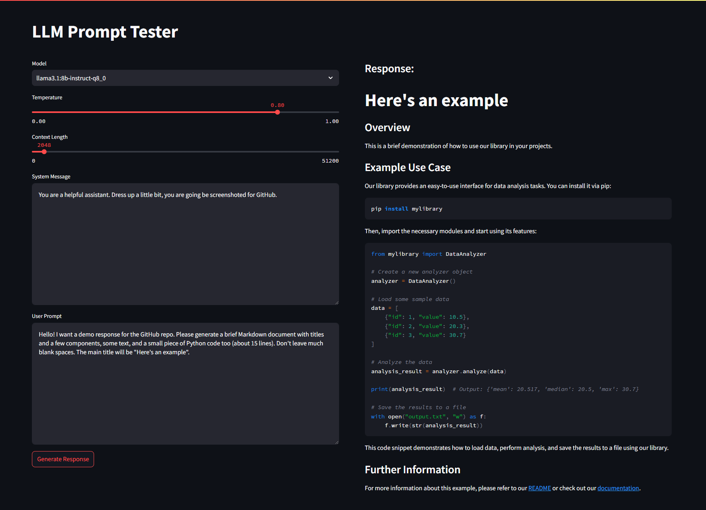

# LLM Prompt Tester

A Streamlit-based tool that makes refining LLM prompts easier.



## Installation

### 1️⃣ Create a virtual environment and install dependencies

In Windows:

```shell
python -m venv env
source env\Scripts\Activate.ps1
pip install -r requirements.txt
```

In MacOS/Linux:

```shell
python -m venv env
source env/bin/activate
pip install -r requirements.txt
```
### 2️⃣ Create a `.env` file in the root folder with the following variables

```env
#Filename: .env
OPEN_WEBUI_BASE_URL=http://example.com
OPEN_WEBUI_API_KEY=example-api-key
```

## Run

With the environment activated, run:
```shell
streamlit run main.py
```
